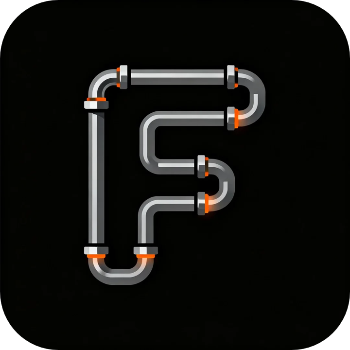

# DiffPipe Forge (Diffusion Pipe Forge)

[English](README.md) | [简体中文](README_zh.md)



**DiffPipe Forge** is a premium, high-performance GUI designed for training state-of-the-art diffusion models. Built with Electron and React, it provides a seamless and visually stunning experience for researchers and AI enthusiasts to fine-tune their models with precision and ease.

> [!NOTE]
> **Attribution**: This project is a GUI wrapper for the original [diffusion-pipe](https://github.com/tdrussell/diffusion-pipe) project by [tdrussell](https://github.com/tdrussell). We have focused on providing the user interface and user experience, while the core training logic is powered by the excellent work of the original author.

## 📸 Preview

<div align="center">
  
  
  <br />
  
  
  <br />
  
  
  <br />
  
</div>

## ✨ Key Features

- **🚀 Extensive Model Support**: support for a wide range of architectures including:
  - **Video Models**: LTX-Video, Hunyuan Video (1.0 & 1.5), Wan (2.1 & 2.2), Cosmos.
  - **Image Models**: Flux (Dev/Schnell), SDXL, Lumina 2.0, SD3/3.5, Qwen-Image.
  - **Specialized Models**: Chroma, HiDream, OmniGen2, AuraFlow, Z-Image.
- **📊 Advanced Dataset Management**:
  - Flexible support for both image and video datasets.
  - Built-in resolution and aspect ratio bucketing (AR Buckets).
  - Multi-path dataset configuration with repeat counts.
- **🛠️ Professional Training Tools**:
  - Support for **LoRA** and **Full Fine-Tuning (FFT)**.
  - **VRAM Optimizations**: Block swapping, activation checkpointing, and 8-bit optimizers for training on consumer hardware (e.g., 24GB GPUs).
  - Multiple optimizer support: AdamW, AdamW8bitKahan, Prodigy, and more.
- **👁️ Real-time Monitoring**:
  - Integrated **TensorBoard** viewer.
  - **Weights & Biases (WandB)** integration.
  - Dedicated **Live Training Log** page with export capabilities.
- **🎨 Premium Experience**:
  - Modern **Glassmorphism** design system.
  - Full support for **Dark Mode** and **Light Mode**.
  - **Multi-language** support (English & Chinese).

## 🛠️ Project Structure

```text
DiffPipeForge/
├── app/                # Main application code (Electron/React)
├── train_config/       # Default directory for configuration files
├── output/             # Training outputs (checkpoints, logs, configs)
├── start.bat           # Main entry point to launch the app
└── requirements.txt    # Python dependencies
```

## 🚀 Getting Started

### Prerequisites

  **Python Environment**: Ensure you have a Python 3.10+ environment installed.
      ```bash
    git clone --recurse-submodules https://github.com/TianDongL/DiffPipeForge.git
    ```

  **Dependencies**:
    ```bash
    pip install torch==2.7.1 torchvision==0.22.1 torchaudio==2.7.1 --index-url https://download.pytorch.org/whl/cu128
    
    pip install -r requirements.txt
    ```
    

### Launching the App

Simply run the `start.bat` file in the project root:
```bash
./start.bat
```

### Your First Training Session

1.  **Select/Create Project**: Launch the app and create a new project or open an existing folder.
2.  **Configure Dataset**: Point to your image or video folders and set your desired resolutions.
3.  **Setup Model**: Choose your architecture (e.g., Flux or Wan) and provide the model paths.
4.  **Optimizer & Training**: Adjust your learning rates and batch sizes.
5.  **Start Training**: Click the "Start Training" button and monitor your progress in the "Training Log" or "Monitor" tabs.

## 📖 Documentation

For detailed configuration examples and model-specific notes, please refer to:
- [Supported Models Guide](supported_models.md)
- [Example Configuration Files](examples/)

